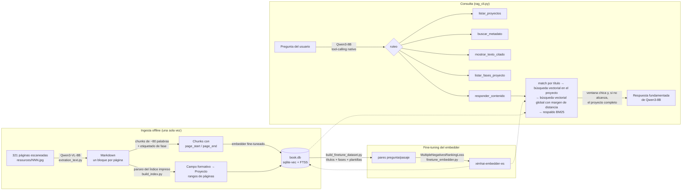

# hackaton-devf-llama

[English](README.md) · **Español**

**Un agente RAG que entiende la estructura de un libro de texto escolar mexicano escaneado, corriendo por completo con modelos locales.**

Este proyecto convierte las 321 páginas escaneadas de *Colección Ximhai. Nuestro libro de proyectos, Primer grado* (SEP, 2023),
un libro de texto de secundaria, en un agente de preguntas y respuestas en español. Sabe **qué** dice el libro y también
**dónde** lo dice: en qué *Campo formativo*, en qué *Proyecto*, en qué fase pedagógica y en qué páginas.

- **Transcripción con VLM:** Qwen3-VL-8B convierte las imágenes de las páginas a Markdown.
- **Parseo del Índice impreso:** la jerarquía del libro se reconstruye a partir de su propio índice.
- **Recuperación híbrida:** búsqueda vectorial en SQLite (`sqlite-vec`) con respaldo BM25 (`FTS5`).
- **Embedder fine-tuneado:** entrenado para este libro y publicado en Hugging Face: [`lau299/ximhai-embedder-es`](https://huggingface.co/lau299/ximhai-embedder-es).
- **Tool-calling nativo:** un LLM local (Qwen3-8B) elige la herramienta adecuada para cada pregunta.
- **Sin APIs en la nube.** Todo corre en una GPU AMD de consumo (RX 7900 XTX, ROCm).

> [!IMPORTANT]
> **El libro de texto no está incluido en este repositorio.** Su contenido es © Secretaría de Educación Pública (SEP), 2023.
> Este repo contiene solo el código fuente. Ver [Cómo obtener el libro](#cómo-obtener-el-libro) y [Licencia y derechos de autor](#licencia-y-derechos-de-autor).

---

## Qué puede responder

| Tipo de pregunta | Herramienta que elige el LLM | Cómo se responde |
|---|---|---|
| *"¿Cuáles son los proyectos del libro?"* | `listar_proyectos` | SQL sobre el índice parseado. Sin generación del LLM, sin alucinaciones |
| *"¿En qué página está la lectura X?"* | `buscar_metadato` | Búsqueda literal; responde con Proyecto y rango de páginas |
| *"Muestra la fase Reconocimiento del proyecto X"* | `mostrar_texto_citado` | Devuelve el texto de esa fase tal cual |
| *"¿Qué fases tiene el proyecto X?"* | `listar_fases_proyecto` | Lista las fases del proyecto, cada una con un fragmento breve |
| *"¿De qué trata el proyecto sobre lenguas indígenas?"* | `responder_contenido` | Recuperación híbrida y respuesta del LLM basada en los fragmentos (amplía el contexto si hace falta) |

El principio de diseño es **pedirle al LLM solo lo que hace mejor**: elegir una herramienta y redactar una respuesta
fundamentada. La estructura, los números de página y las citas textuales se resuelven de forma determinista desde la base de datos.

## Arquitectura



### Decisiones clave de diseño

- **La estructura sale del Índice impreso, no de los encabezados Markdown.** Los niveles `#`/`##` que genera el VLM no son confiables
  (319 apariciones de `#`, muchas de ellas párrafos completos marcados como encabezado por error). El índice impreso es la jerarquía oficial
  del libro, y sus números de página coinciden exactamente con los nombres de los archivos escaneados (verificado en las 321 páginas).
- **Tres esquemas de fases pedagógicas, 22 fases.** Los proyectos siguen secuencias de fases distintas según su tipo
  (*Lenguajes*, *indagación científica*, *sociocrítico*). Con solo el primer esquema, `chunk.fase` quedaba vacío en 27 de 38 proyectos.
  La detección de fases usa un vocabulario cerrado con las variantes reales de la transcripción y un límite de longitud, para que
  un título de proyecto que contiene "comunicación" no se etiquete como la fase *Comunicación*.
- **La procedencia de cada chunk son dos enteros** (`page_start`, `page_end`). El chunking recorre el libro en orden, así que los rangos siempre son contiguos.
- **Los vectores viven en una tabla virtual `vec0`** unida por rowid a las tablas de metadatos, que es la forma que espera `sqlite-vec`.
- **La recuperación va por capas, de lo más barato y preciso a lo más general:** match exacto o difuso del título del proyecto,
  luego búsqueda vectorial *restringida a ese proyecto*, luego búsqueda vectorial global conservando solo resultados dentro del 8%
  de la mejor distancia, y por último respaldo BM25 por palabras clave cuando la mejor distancia vectorial no es confiable (> 0.93).
- **El contexto empieza chico y solo crece si falla.** El primer intento usa una ventana de ±5 chunks. Si el modelo responde
  "no encontré", reintenta con el proyecto completo. Las preguntas que abarcan demasiados temas reciben una lista de proyectos
  candidatos para acotar, en lugar de una respuesta diluida.

## Experimentos, incluidos los que fallaron

Estos resultados definieron el diseño final. Cada uno registra qué se intentó, qué se midió y qué cambié a partir de ello.

### 1. Embeddings on-device con MediaPipe: descartado
El plan original era calcular los embeddings de las preguntas en el dispositivo con el Text Embedder de MediaPipe.
- **Universal Sentence Encoder por defecto:** no separa nada en español. Los pares de oraciones del libro *no relacionados* obtuvieron
  en promedio una similitud **mayor** (0.911) que los pares similares (0.891).
- **USE multilingüe:** no carga (`FlexSentencepieceOp failed to prepare`). La solución está documentada solo para Android, pero confirmé
  que el mismo error se reproduce en la versión de escritorio de MediaPipe para Python.
- **`paraphrase-multilingual-MiniLM-L12-v2` (el elegido):** pares similares 0.46–0.62 (media 0.53), pares no relacionados −0.09–0.21 (media 0.07). La separación es limpia.

→ Quité la capa de Tasks de MediaPipe y usé un modelo de sentence-transformers directamente. El plan on-device ahora apunta a este modelo vía ONNX Runtime.

### 2. Elección del VLM para transcribir: Gemma-4-26B MoE no cabía en 24 GB
- `google/gemma-4-26B-A4B-it` guarda los pesos de sus expertos MoE como tensores agrupados, no como `nn.Linear`, así que la cuantización
  4-bit de bitsandbytes se saltó en silencio ~25B de los 26B parámetros y se quedó sin memoria al cargar. El checkpoint AWQ de la comunidad
  tiene el mismo hueco (los expertos están en su lista `ignore`). FP8 (~26 GB) no cabe, y NVFP4 es exclusivo de NVIDIA.
- → Cambié al modelo denso **Qwen3-VL-8B-Instruct** en bf16 (~16 GB), fijado a `cuda:0` para que `accelerate` no reparta capas en la GPU integrada.
- Una página densa de créditos a 4 columnas provocó un **bucle de repetición** (un bloque repetido 9 veces). `no_repeat_ngram_size=4` detenía
  el bucle pero corrompía texto que legítimamente se repite (nombres, conectores). Un `repetition_penalty=1.15` moderado lo resolvió sin ese daño.
- La primera corrida completa **murió por falta de memoria tras ~95 páginas sin guardar nada**. → Ahora la salida se escribe página por página.

### 3. Por qué el embedder necesitaba fine-tuning
Con el modelo base, *"¿qué es Juguemos con la lengua?"* dejaba el contenido del proyecto correcto **más lejos** de la pregunta (L2 ≈ 0.87)
que proyectos sin relación (≈ 0.81), porque el título no se repite en el cuerpo del texto. Generé 524 pares de entrenamiento a partir de la
estructura del propio libro (títulos de proyecto × fases × plantillas de preguntas) más casos reales de fallo seleccionados a mano, y entrené con
`MultipleNegativesRankingLoss`. La pérdida de validación bajó de **0.974 a 0.198** en 6 épocas (~16 s de entrenamiento).
A partir de ahí, las preguntas tipo glosario se resolvieron solo con búsqueda vectorial, sin el respaldo léxico.

### 4. Ruteo de intención: dos intentos con ML revertidos con datos, reemplazados por tool-calling nativo
Decidir *qué acción* necesita una pregunta (listar la estructura / citar texto / buscar página / responder contenido) pasó por cuatro iteraciones:

| Enfoque | Resultado | Desenlace |
|---|---|---|
| Regex de palabras disparadoras | 15–16/16 en el set de prueba, pero se rompía con cada redacción no prevista (`muéstrame` vs `muestra`, `qué`/`está` con acento) | Reemplazado |
| Similitud de embeddings zero-shot contra frases de ejemplo | **10/15**, con márgenes de decisión de 0.002–0.06 entre clases | Revertido |
| Clasificador dedicado fine-tuneado con `BatchAllTripletLoss` (~80 ejemplos, sin entidades) | **10/16**, sobreajustado | Revertido |
| **Tool-calling nativo de Qwen3-8B** (`apply_chat_template(tools=...)`) | Maneja todas las redacciones que rompían el regex; además extrae los argumentos (entidad, fase) | **En producción** |

El error común de los tres primeros fue que todos intentaban *enumerar* cada forma posible de preguntar. El tool-calling le deja ese trabajo
a un modelo que ya entiende español. El código de estos experimentos no está en este repo; las cifras de arriba vienen de sus registros.

### 5. Gemma-4 en ROCm: crash reproducible de la GPU, resuelto con llama.cpp
Usar Gemma-4 (E2B/E4B) como LLM de respuesta vía `transformers` sobre ROCm tumba la GPU a nivel de hardware
(`HSA_STATUS_ERROR_EXCEPTION`, en `_assert_async_cuda_kernel`). Lo reproduje en **cuatro rutas de carga** (clase específica del modelo,
`AutoModelForMultimodalLM` + `device_map="auto"`, `dtype="auto"` y dos builds distintos de torch/ROCm), siempre en bf16.
En float32 no crashea, pero genera texto incoherente. Es una incompatibilidad entre la implementación `gemma4` y los kernels de ROCm,
y no se puede arreglar desde este proyecto.
→ Correr el GGUF (`gemma-4-E4B-it-Q4_K_M`) con **`llama-server` de llama.cpp** (backend Vulkan) funciona en la misma GPU,
incluido el tool-calling: el servidor normaliza las etiquetas propias de Gemma a `tool_calls` estilo OpenAI. Un detalle más:
hubo que desactivar el modo *thinking* de Gemma, porque si no gastaba todo el presupuesto de tokens razonando y nunca emitía la llamada a la herramienta.

## Stack técnico

| Capa | Elección |
|---|---|
| Transcripción | `Qwen/Qwen3-VL-8B-Instruct` (bf16) vía 🤗 `transformers` |
| Embeddings | `paraphrase-multilingual-MiniLM-L12-v2`, fine-tuneado con `sentence-transformers` (384 dimensiones, mean pooling, normalización L2) |
| Base vectorial | SQLite + [`sqlite-vec`](https://github.com/asg017/sqlite-vec) (`vec0`) + FTS5/BM25 |
| LLM / ruteo | `Qwen/Qwen3-8B` con tool-calling nativo (modo sin *thinking*) |
| Hardware | AMD Radeon RX 7900 XTX (24 GB), ROCm, PyTorch; Python 3.14 |

## Inicio rápido: consultar el índice ya construido

**Requisitos:** una GPU con ≥ 20 GB de VRAM para Qwen3-8B en bf16 (probado en ROCm; en CUDA debería funcionar sin cambios), y Python 3.10+
(probado en 3.14) cuyo módulo `sqlite3` permita cargar extensiones.

```bash
git clone https://github.com/lauro299/hackaton-devf-llama.git && cd hackaton-devf-llama
python -m venv .venv && source .venv/bin/activate
# 1. Instala primero PyTorch para tu GPU: https://pytorch.org/get-started/locally/
pip install -r requirements.txt

# 2. Descarga el índice ya construido (book.db) desde el Release de GitHub
./scripts/download_artifacts.sh

# 3. Haz preguntas (el embedder fine-tuneado se descarga solo desde Hugging Face)
python app/rag_cli.py --db book.db
```

El `book.db` ya construido se publica como archivo del Release para evaluación y uso educativo. Contiene texto derivado del
libro de la SEP; ver [Licencia y derechos de autor](#licencia-y-derechos-de-autor).

## Reproducir el pipeline completo

### Cómo obtener el libro
La SEP distribuye el libro gratuitamente a través de CONALITEG en <https://libros.conaliteg.sep.gob.mx/>
(Secundaria → 1er grado → *Nuestro libro de proyectos*). Descarga el PDF y genera un JPEG por página, nombrado con el número de página
**impreso**. El parser del índice depende de que `014.jpg` sea la página impresa 14:

```bash
python scripts/pdf_to_pages.py libro.pdf --offset <N>   # verifica algunas páginas contra el Índice impreso
```

### Ejecución
```bash
# Transcribir las imágenes a Markdown (~16 GB de VRAM, página por página)
python app/extration_text.py --input './resources/*.jpg' --output resultado.md --separator

# Construir el índice con el modelo base y generar a partir de él los pares de fine-tuning
python app/build_index.py --input resultado.md --output book.db
python app/build_finetune_dataset.py
python app/finetune_embedder.py --output models/embedder-book-finetuned

# Reconstruir el índice con el embedder fine-tuneado y consultarlo
python app/build_index.py --input resultado.md --output book.db --model models/embedder-book-finetuned
python app/rag_cli.py --db book.db --embedder models/embedder-book-finetuned
```

## Estructura del repositorio

```
app/
  extration_text.py          transcripción con VLM (imágenes → Markdown)
  build_index.py             parseo del Índice, chunking, etiquetado de fases, índice sqlite-vec/FTS5
  build_finetune_dataset.py  pares pregunta/pasaje generados a partir del índice
  finetune_embedder.py       fine-tuning contrastivo (MultipleNegativesRankingLoss)
  rag_cli.py                 CLI de RAG con tool-calling
scripts/
  download_artifacts.sh      descarga el book.db ya construido
  pdf_to_pages.py            PDF → resources/NNN.jpg por número de página impreso
```

## Hoja de ruta

- Embeddings de la pregunta en el dispositivo: un núcleo nativo compartido (ONNX Runtime) expuesto vía **JNI** y vía
  **`cinterop` de Kotlin/Native**, comparados entre sí usando la misma biblioteca compilada.
- Una app de escritorio en Kotlin Multiplatform sobre el mismo `book.db`.

## Licencia y derechos de autor

- **Código:** [MIT](LICENSE) © 2026 José Castañeda.
- **Modelo fine-tuneado:** Apache-2.0, heredada del modelo base. Ver la [ficha del modelo](https://huggingface.co/lau299/ximhai-embedder-es).
- **Contenido del libro:** *Colección Ximhai. Nuestro libro de proyectos. Primer grado*, D.R. © Secretaría de Educación Pública, 2023.
  Los escaneos, la transcripción y los datos de entrenamiento **no** están en este repositorio ni en su historia. El archivo `book.db` del
  Release contiene texto derivado y se ofrece solo para evaluación educativa sin fines de lucro. Se retirará si el titular de los derechos lo solicita.
