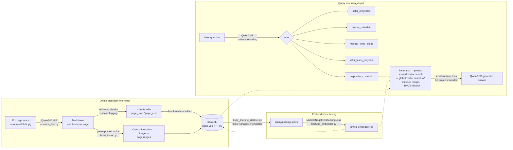

# hackaton-devf-llama

**English** · [Español](README.es.md)

**A structure-aware RAG agent over a scanned Mexican public-school textbook, running entirely on local models.**

This project turns 321 scanned pages of *Colección Ximhai. Nuestro libro de proyectos, Primer grado* (SEP, 2023),
a Mexican secondary-school textbook, into a Spanish question-answering agent. It knows **what** the book says,
and it also knows **where** it says it: which *Campo formativo*, which *Proyecto*, which pedagogical phase, and which pages.

- **VLM transcription:** Qwen3-VL-8B turns page images into Markdown.
- **Printed-index parsing:** the book's hierarchy is rebuilt from its own printed table of contents.
- **Hybrid retrieval:** vector search in SQLite (`sqlite-vec`) with a BM25 (`FTS5`) fallback.
- **Fine-tuned embedder:** trained for this book and published on Hugging Face: [`lau299/ximhai-embedder-es`](https://huggingface.co/lau299/ximhai-embedder-es).
- **Native tool-calling:** a local LLM (Qwen3-8B) picks the right tool for each question.
- **No cloud APIs.** Everything runs on one consumer AMD GPU (RX 7900 XTX, ROCm).

> [!IMPORTANT]
> **The textbook is not included in this repository.** Its content is © Secretaría de Educación Pública (SEP), 2023.
> This repo contains only the source code. See [Getting the book](#getting-the-book) and [Copyright](#license-and-copyright).

---

## What it can answer

| Question type (Spanish in, Spanish out) | Tool the LLM picks | How it is answered |
|---|---|---|
| *"¿Cuáles son los proyectos del libro?"* | `listar_proyectos` | SQL over the parsed index. No LLM generation, no hallucination |
| *"¿En qué página está la lectura X?"* | `buscar_metadato` | Literal lookup, answered with Proyecto + page range |
| *"Muestra la fase Reconocimiento del proyecto X"* | `mostrar_texto_citado` | Returns the tagged phase text verbatim |
| *"¿Qué fases tiene el proyecto X?"* | `listar_fases_proyecto` | Lists that project's phases, each with a short snippet |
| *"¿De qué trata el proyecto sobre lenguas indígenas?"* | `responder_contenido` | Hybrid retrieval, then grounded LLM answer (widens context if needed) |

The design principle is to **only ask the LLM for what it's uniquely good at**: choosing a tool, and writing
grounded prose. Structure, page numbers and verbatim quotes are answered deterministically from the database.

## Architecture



### Key design decisions

- **Structure comes from the printed Índice, not from Markdown headings.** The VLM's `#`/`##` levels are unreliable
  (319 `#` occurrences, many of them whole paragraphs mislabelled as headings). The printed table of contents is the book's own
  authoritative hierarchy, and its page numbers match the scan filenames exactly (verified across all 321 pages).
- **Three pedagogical phase schemes, 22 phases.** Projects follow different phase sequences depending on their type
  (*Lenguajes*, *indagación científica*, *sociocrítico*). Supporting only the first scheme left `chunk.fase` empty in 27/38 projects.
  Phase detection uses a closed vocabulary with real transcription variants plus a length guard, so a project title that
  happens to contain "comunicación" isn't tagged as the *Comunicación* phase.
- **Page provenance is two integers** (`page_start`, `page_end`). Chunking walks the book in order, so ranges are always contiguous.
- **Vectors live in a `vec0` virtual table joined by rowid** to the metadata tables, the shape `sqlite-vec` expects.
- **Retrieval is layered, cheapest-and-most-precise first:** exact/fuzzy project-title match, then vector search
  *restricted to that project*, then global vector search keeping only results within 8% of the best distance, then
  BM25 keyword fallback when the best vector distance is untrustworthy (> 0.93).
- **Context starts small and widens only on failure.** The first try uses a ±5-chunk window. If the model answers
  "not found", it retries with the whole project. Questions that span too many topics get a "please narrow it down" list
  of candidate projects instead of a diluted answer.

## Experiments, including the ones that failed

These results shaped the final design. Each entry records the attempt, the measurement, and what I changed because of it.

### 1. On-device embedding with MediaPipe: rejected
The original plan was to compute query embeddings on-device with MediaPipe's Text Embedder.
- **Default Universal Sentence Encoder:** no separation at all on Spanish. *Unrelated* sentence pairs from the book scored
  **higher** on average (0.911) than similar pairs (0.891).
- **Multilingual USE:** fails to load (`FlexSentencepieceOp failed to prepare`). The fix is documented as Android-only, but I
  confirmed the same failure reproduces in MediaPipe's desktop Python build.
- **`paraphrase-multilingual-MiniLM-L12-v2` (selected):** similar pairs 0.46–0.62 (mean 0.53), unrelated pairs −0.09–0.21 (mean 0.07). The separation is clean.

→ I dropped the MediaPipe Tasks layer and used a sentence-transformers model directly. The on-device plan now targets this model via ONNX Runtime.

### 2. Choosing the VLM for transcription: Gemma-4-26B MoE could not fit in 24 GB
- `google/gemma-4-26B-A4B-it` stores its MoE expert weights as batched tensors, not `nn.Linear`, so bitsandbytes 4-bit
  silently skipped ~25B of the 26B parameters and ran out of memory while loading. The community AWQ checkpoint has the same gap
  (the experts are in its `ignore` list). FP8 (~26 GB) doesn't fit, and NVFP4 is NVIDIA-only.
- → Switched to the dense **Qwen3-VL-8B-Instruct** in bf16 (~16 GB), pinned to `cuda:0` so `accelerate` doesn't spill layers onto the iGPU.
- A dense 4-column credits page caused a **repetition loop** (one block repeated 9×). `no_repeat_ngram_size=4` stopped the loop
  but corrupted legitimately repeated text (names, connectors). A moderate `repetition_penalty=1.15` fixed the loop without that damage.
- The first full run was **OOM-killed after ~95 pages with nothing saved**. → The output is now flushed page by page.

### 3. Why the embedder needed fine-tuning
With the base model, *"¿qué es Juguemos con la lengua?"* put the correct project's content **farther** from the query (L2 ≈ 0.87)
than unrelated projects (≈ 0.81), because the title isn't repeated in the body text. I built 524 training pairs from the book's own
structure (project titles × phases × question templates) plus curated real failure cases, and trained with
`MultipleNegativesRankingLoss`. Validation loss went from **0.974 to 0.198** in 6 epochs (~16 s of training).
After this, glossary-style questions resolved by vector search alone, without the lexical fallback.

### 4. Intent routing: two ML attempts reverted with data, replaced by native tool-calling
Deciding *which action* a question needs (list structure / quote text / page lookup / answer content) went through four iterations:

| Approach | Result | Outcome |
|---|---|---|
| Regex trigger words | 15–16/16 on the test set, but broke on every unanticipated phrasing (`muéstrame` vs `muestra`, accented `qué`/`está`) | Replaced |
| Zero-shot embedding similarity to example phrases | **10/15**, with decision margins of 0.002–0.06 between classes | Reverted |
| Dedicated classifier fine-tuned with `BatchAllTripletLoss` (~80 examples, entity-free) | **10/16**, overfitted | Reverted |
| **Qwen3-8B native tool-calling** (`apply_chat_template(tools=...)`) | Handles all the phrasings that broke the regex; it also extracts arguments (entity, phase) | **Shipped** |

The common failure of the first three was that they all tried to *enumerate* every way of asking. Tool-calling hands that
job to a model that already understands Spanish. The experiment code is kept out of this repo; the numbers above come from its logs.

### 5. Gemma-4 on ROCm: reproducible GPU crash, worked around with llama.cpp
Trying Gemma-4 (E2B/E4B) as the answering LLM through `transformers` on ROCm crashes the GPU at the hardware level
(`HSA_STATUS_ERROR_EXCEPTION`, in `_assert_async_cuda_kernel`). I reproduced it across **four loading paths** (model-specific
class, `AutoModelForMultimodalLM` + `device_map="auto"`, `dtype="auto"`, and two different torch/ROCm builds), always in bf16.
float32 doesn't crash, but it produces incoherent output. This is an incompatibility between the `gemma4` implementation and
the ROCm kernels, and it can't be fixed from this project.
→ Running the GGUF (`gemma-4-E4B-it-Q4_K_M`) through **llama.cpp's `llama-server`** (Vulkan backend) works on the same GPU,
including tool-calling: the server normalizes Gemma's custom tool-call tags into OpenAI-style `tool_calls`. One more
detail: Gemma's thinking mode had to be disabled, because otherwise it spent the whole token budget reasoning and never emitted the tool call.

## Tech stack

| Layer | Choice |
|---|---|
| Transcription | `Qwen/Qwen3-VL-8B-Instruct` (bf16) via 🤗 `transformers` |
| Embeddings | `paraphrase-multilingual-MiniLM-L12-v2`, fine-tuned with `sentence-transformers` (384-dim, mean pooling, L2-normalized) |
| Vector store | SQLite + [`sqlite-vec`](https://github.com/asg017/sqlite-vec) (`vec0`) + FTS5/BM25 |
| LLM / routing | `Qwen/Qwen3-8B` with native tool-calling (non-thinking mode) |
| Hardware | AMD Radeon RX 7900 XTX (24 GB), ROCm, PyTorch; Python 3.14 |

## Quickstart: query the prebuilt index

**Requirements:** a GPU with ≥ 20 GB VRAM for Qwen3-8B in bf16 (tested on ROCm; CUDA should work unchanged), and Python 3.10+ (tested on 3.14)
whose `sqlite3` module supports loading extensions.

```bash
git clone https://github.com/lauro299/hackaton-devf-llama.git && cd hackaton-devf-llama
python -m venv .venv && source .venv/bin/activate
# 1. Install PyTorch for your GPU first: https://pytorch.org/get-started/locally/
pip install -r requirements.txt

# 2. Download the prebuilt index (book.db) from the GitHub Release
./scripts/download_artifacts.sh

# 3. Ask questions (the fine-tuned embedder downloads from Hugging Face automatically)
python app/rag_cli.py --db book.db
```

The prebuilt `book.db` is published as a Release asset for evaluation and educational use. It contains text derived from
the SEP textbook; see [Copyright](#license-and-copyright).

## Reproducing the full pipeline

### Getting the book
SEP distributes the textbook free of charge through CONALITEG at <https://libros.conaliteg.sep.gob.mx/>
(Secundaria → 1er grado → *Nuestro libro de proyectos*). Download the PDF, then render one JPEG per page named by the
**printed** page number. The index parser relies on `014.jpg` being printed page 14:

```bash
python scripts/pdf_to_pages.py book.pdf --offset <N>   # check a few pages against the printed Índice
```

### Running it
```bash
# Transcribe page images to Markdown (~16 GB VRAM, runs page by page)
python app/extration_text.py --input './resources/*.jpg' --output resultado.md --separator

# Build the index with the base model, then generate fine-tuning pairs from it
python app/build_index.py --input resultado.md --output book.db
python app/build_finetune_dataset.py
python app/finetune_embedder.py --output models/embedder-book-finetuned

# Rebuild the index with the fine-tuned embedder and query it
python app/build_index.py --input resultado.md --output book.db --model models/embedder-book-finetuned
python app/rag_cli.py --db book.db --embedder models/embedder-book-finetuned
```

## Repository layout

```
app/
  extration_text.py          VLM transcription (page images → Markdown)
  build_index.py             Índice parsing, chunking, phase tagging, sqlite-vec/FTS5 index
  build_finetune_dataset.py  query/passage pairs generated from the index
  finetune_embedder.py       contrastive fine-tuning (MultipleNegativesRankingLoss)
  rag_cli.py                 tool-calling RAG CLI
scripts/
  download_artifacts.sh      fetch the prebuilt book.db
  pdf_to_pages.py            PDF → resources/NNN.jpg by printed page number
```

## Roadmap

- On-device query embedding: a shared native core (ONNX Runtime) exposed through **JNI** and **Kotlin/Native `cinterop`**,
  benchmarked against each other with the same compiled library.
- A Kotlin Multiplatform desktop app on top of the same `book.db`.

## License and copyright

- **Code:** [MIT](LICENSE) © 2026 José Castañeda.
- **Fine-tuned model:** Apache-2.0, inherited from the base model. See the [model card](https://huggingface.co/lau299/ximhai-embedder-es).
- **Textbook content:** *Colección Ximhai. Nuestro libro de proyectos. Primer grado*, D.R. © Secretaría de Educación Pública, 2023.
  The scans, transcription and training data are **not** in this repository or its history. The prebuilt `book.db` Release asset
  contains derived text and is provided for non-commercial, educational evaluation only. It will be removed at the rights holder's request.
